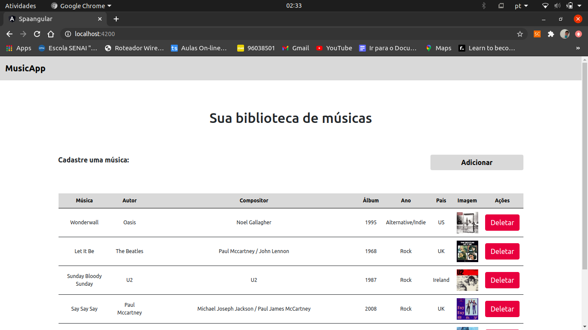

# SPA com Angular

<hr>
Single Page Application Angular destinada a listagem, cadastro e remoção de músicas. A Aplicação foi feita usando a dependência bootstrap para estilizar e é alimentada com um mock de servidor criado com a dependência json-server.

### Executar aplicação completa
<hr>
Faça a instalação das dependências:
```
	npm install
```

Abra uma aba do seu terminal e execute a aplicação angular:

```
	ng serve -o
```

Agora abra outra aba e inicie o mock do servidor para ficar disponível as requisições mandadas pelo nosso front-end.

```
	json-server --watch db.json
```

### Tecnologias
<hr>
* Angular
* Json-Server
* Bootstrap
* Javascript
* Typescript
* HTML5
* CSS3

### Componentes
<hr>
Os componentes foram divididos entre as pastas **/shared** e **/core**, a primeira sendo responsável por guardar os componentes que aparecerão nas duas telas e a outra destinada a guardar os componentes de lista e de formulário.

## Serviço
<hr>
O serviço que temos em **musica.service.ts** concentra os métodos que farão as requisições HTTP (GET, POST, DELETE) disponíveis para os nossos componentes.

### Autor
<hr>

```
	Fernando Santos De Freitas
```

